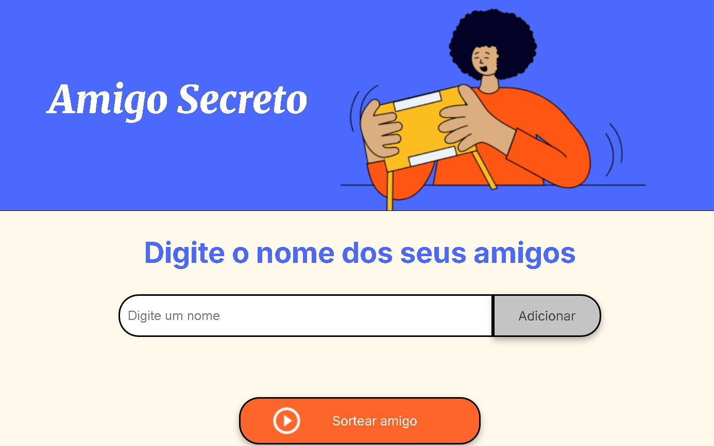
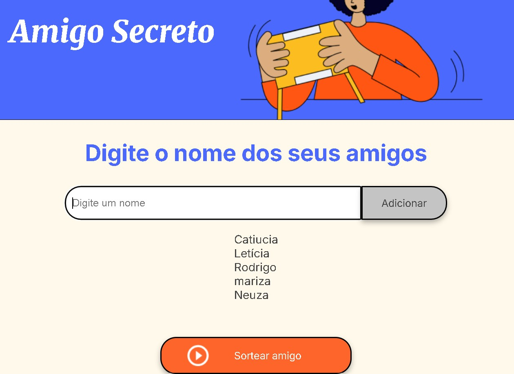
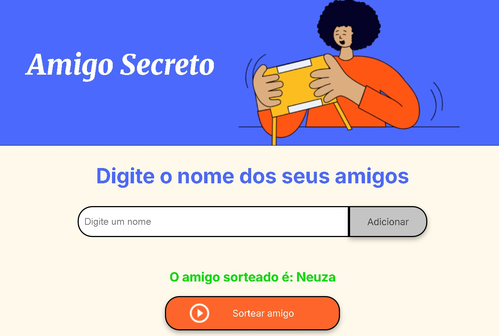

## 🎁 Sorteio de Amigo Secreto

Este é um projeto simples desenvolvido em HTML, CSS e JavaScript que permite adicionar nomes a uma lista e realizar um sorteio aleatório para determinar quem será o amigo secreto.

## 🚀 Funcionalidades
<ul>
<li>✅ <strong>Adicionar nomes</strong> à lista de participantes</li>
<li>✅ <strong>Exibir a lista de amigos</strong> adicionados</li>
<li>✅ <strong>Sortear aleatoriamente</strong> um amigo secreto</li>
<li>✅ <strong>Exibir o nome</strong> do sorteado na tela</li>
<li>✅ <strong>Interface simples e intuitiva</strong> para fácil uso</li>
</ul>

## 📸 Capturas de Tela  

### 🔹 Tela inicial  

  
### 🔹 Após adicionar amigos  
  

### 🔹 Resultado do sorteio  

---

## 🛠️ Tecnologias Utilizadas  

- HTML5  
- CSS3  
- JavaScript  

---

## 📌 Como Executar o Projeto  

1️⃣ Clone este repositório:  
git clone https://github.com/seu-usuario/amigo-secreto.git

2️⃣ Acesse a pasta do projeto:
cd amigo-secreto

3️⃣ Abra o arquivo index.html no navegador.

---
## 🔧 Possíveis Melhorias

📌 Melhorar o design e responsividade da interface.
 

📌 Adicionar funcionalidade para salvar os participantes entre sessões.
 

---
## 📝 Contribuição

Sinta-se à vontade para contribuir com melhorias! Caso encontre algum problema ou tenha sugestões, abra uma issue no repositório.

---

## Acesse o projeto no GitHub
Você pode acessar o código-fonte completo e contribuir para o projeto através do [meu repositório no GitHub](https://github.com/tayFigueredo/amigo_secreto).

Criado por: Taynara Rocha Figueredo
 

